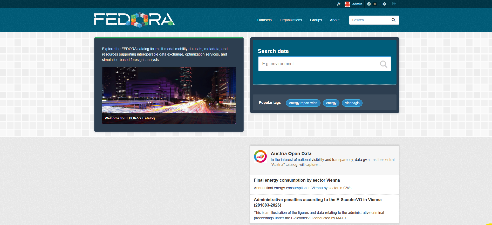

# How To Harvest

There are two ways to configure harvesting: manually using the graphical interface, or automatically using a script. This guide demonstrates the automatic approach, which is less time consuming and highly reproducible.

## Prerequisites

Before you begin, make sure you have completed the [Installation](installation.md) steps and connected to the Data Catalogue platform (based on CKAN).

The following image shows the home page of our Data Catalogue:

## Steps

### 1. Get an API token

Get a token in order to grant API access and authorize remote calls.
