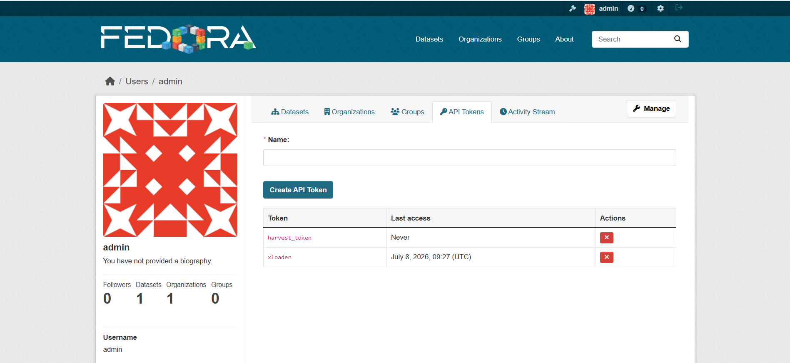
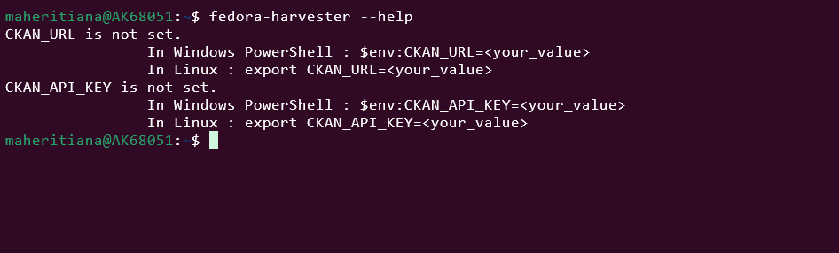
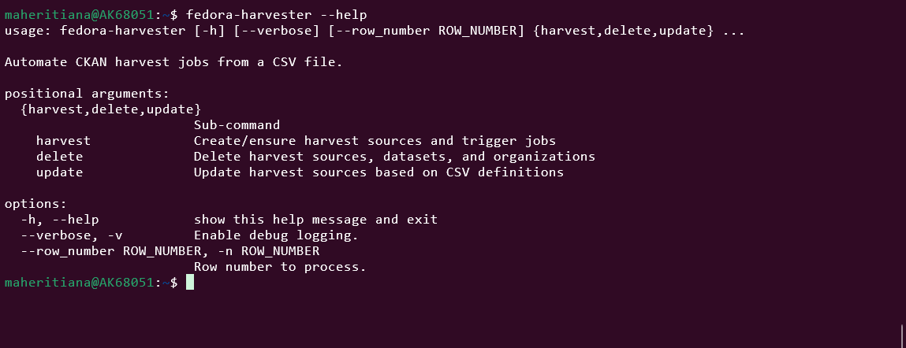
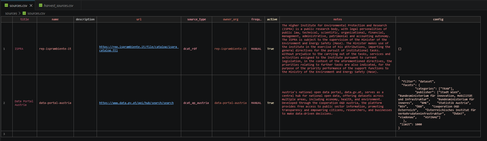

# How To Harvest

There are two ways to configure harvesting: manually using the graphical interface, or automatically using a script. This guide demonstrates the automatic approach, which is less time consuming and highly reproducible.

## Prerequisites

Before you begin, make sure you have completed the [Installation](installation.md) steps and connected to the Data Catalogue platform (based on CKAN).

The following image shows the home page of our Data Catalogue:


## Steps

### 1. Get an API token

Get a token in order to grant API access and authorize remote calls.

For that, go to the admin -> API Token , as shown in the following figure



### 2. Configure fedora-harvester

After installation, check if tool is available and work correctly 

Run `fedora-hervester --help` command line, and you should see the following message 



It means tool work properly, but configuration is not yet done.

Configure fedora harvester by running proposed command.

Then run again `fedora-hervester --help` .

You should see all available options



### 3. Prepare your csv file 

All need information for organizations and source creation should be added in the csv file, 



Here, in the example above , we have 2 sources to harvest

As shown in the `fedora-harvester --help` , we can either harvest all sources or only a specific row.

For harvesting all rows, you should the following command : 

```bash
  # fedora-harvester -n <number_row> harvest <csv_file_path>
```

