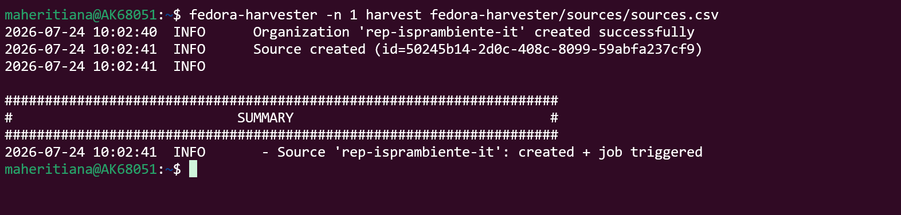
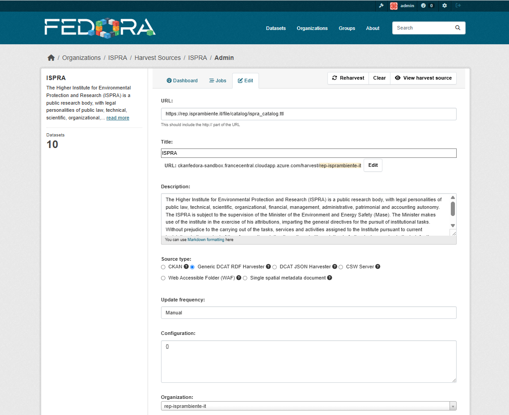

# How to Harvest

Harvesting can be configured either manually through the CKAN graphical interface or automatically using the fedora-harvester tool. This guide covers the automatic approach, which offers greater efficiency and reproducibility.

## Prerequisites

Before proceeding, ensure that you have completed the [Installation](installation.md) steps and have access to the Data Catalogue platform (based on CKAN).

The following image shows the home page of the Data Catalogue:


## Procedure

### 1. Obtain an API Token

An API token is required to authorise remote calls to the Data Catalogue.

To generate a token, navigate to **Admin → API Token**, as illustrated below.


### 2. Configure fedora-harvester

Once the installation is complete, verify that fedora-harvester is installed and functioning correctly.

Run the following command:

```bash
fedora-harvester --help
```

You should see the output below, which confirms that the tool is operational but not yet configured:


Complete the initial configuration by running the command provided in the output.

Once configured, run `fedora-harvester --help` again. The full list of available options should now be displayed:


### 3. Prepare the CSV Source File

All required information for defining organisations and data sources must be provided in a CSV file.


The example above contains two sources to harvest.

As shown in the `fedora-harvester --help` output, you can harvest either all sources or a specific row.

#### Harvesting a Specific Row

To harvest a single row from the CSV file, run:

```bash
fedora-harvester -n <number_row> harvest <csv_file_path>
```



#### Harvesting All Rows

To harvest all rows in the CSV file, run:

```bash
fedora-harvester harvest <csv_file_path>
```

### Result

Upon successful completion, all information defined in the CSV source file will be reflected in the Data Catalogue. The following image shows the expected result:



## Conclusion

This guide has walk you through the complete harvesting workflow using fedora-harvester — from obtaining an API token and configuring the tool to executing harvest jobs. By leveraging this automated approach, you can efficiently manage and update your Data Catalogue with minimal manual intervention. For further details on installation or advanced usage, refer to the [Installation](installation.md) and [Introduction](introduction.md) pages.
